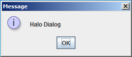
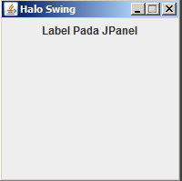

###Subject :###
- Membuat Frame
- Membuat Dialogbox
- Membuat Panel

###Objective :###
- Memahami Pembuatan Frame Pada Java
- Memahami Pembuatan Dialogbox Pada Java
- Memahami Pembuatan Panel Pada Java

###Tugas Praktikum Sesi 1###

##Latihan : Membuat Frame, Dialogbox dan Panel Pada Java##

Langkah – Langkah Pembuatan Frame :
1. Langkah pertama adalah membuat struktur folder sebagai berikut :


2. Buka cmd (Command Prompt) dan ketikkan perintah ini :

```mvn archetype:create -DgroupId=com.artivisi.project -DartifactId=my-app```

3. Buat file `BelajarFrame.java` pada src\main\java\com\artivisi\project. 
dengan isi sebagai berikut :

```java
package com.artivisi.project;

import javax.swing.JFrame;
import javax.swing.JPanel;
import javax.swing.JOptionPane;
import javax.swing.JLabel;

public class HaloSwing {
	public static void main(String[] xx){
		JFrame fr = new JFrame();                               
		fr.setTitle("Halo Swing"); 		
		
		fr.setSize(200,200);
		fr.setLocationRelativeTo(null);
		fr.setDefaultCloseOperation(JFrame.EXIT_ON_CLOSE);
		
		fr.setResizable(false);
		
		JPanel pnl = new JPanel();
		JLabel lbl = new JLabel("Label Pada JPanel");
		pnl.add(lbl);
		fr.add(pnl);
		JOptionPane.showMessageDialog(null, "Halo Dialog");
		
		fr.setVisible(true);
		
	}
}
```


3.	Jika sudah maka kita compile file HaloSwing.java dengan perintah berikut :

```
mvn exec:java -Dexec.mainClass="com.artivisi.project.HaloSwing"
```

4. Jika berhasil akan muncul seperti gambar berikut :


